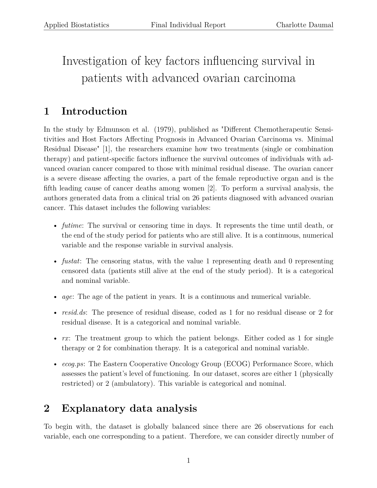

# Investigation of key factors influencing survival in patients with advanced ovarian carcinoma 

**Author:** Charlotte Daumal   
**Context:** This project was completed as part of the *Applied Biostatistics* course taught by Prof. Darlene Goldstein
**Language:** R  
**Date:** June 2024

---

## 📘 Project Overview

This project applies statistical survival analysis methods to clinical data from a cohort of 26 patients diagnosed with advanced ovarian carcinoma. The dataset originates from the seminal study by Edmunson et al. (1979) and investigates how treatments and patient-specific factors influence survival outcomes.

The analysis includes:

- Univariate and bivariate exploratory data analysis (EDA)
- Kaplan-Meier survival estimation
- Log-rank tests
- Cox proportional hazards regression modeling
- Assessment of model assumptions using Schoenfeld, Martingale, and Deviance residuals

---

## 💻 Repository Structure

An overview of the contents of this repository:

- `.gitattributes` — Git configuration file for cross-platform consistency  
- `.gitignore` — Specifies files and directories to be excluded from version control  

- `src/` — Contains the RMarkdown source code used to generate the report  
  └── `survival_analysis_report.Rmd`  

- `figures/` — Includes the output figures (in PDF format) used in the final report  
  └── `*.pdf`  

- `report_final/` — Folder containing the final deliverables  
  ├── `00_Individual_Report_Applied_Biostatistics.pdf` — Complete version of the final report  
  └── `first_page_preview.png` — Preview image of the report’s first page (used in the README)

---

## 📚 Dataset

The dataset consists of the following clinical and demographic variables:

| Variable   | Description |
|------------|-------------|
| `futime`   | Survival or censoring time (in days) |
| `fustat`   | Censoring status (1 = death, 0 = censored) |
| `age`      | Age of the patient |
| `resid.ds` | Residual disease (1 = none, 2 = present) |
| `rx`       | Treatment (1 = single therapy, 2 = combination therapy) |
| `ecog.ps`  | ECOG performance status (1 = restricted, 2 = ambulatory) |

---

## 📊 Preview of the Report

🗂 The full report is available in PDF format in the `report` folder.

---

## License

This project is for educational purposes and does not provide medical advice.  
Content © Charlotte Daumal. Academic use only.
